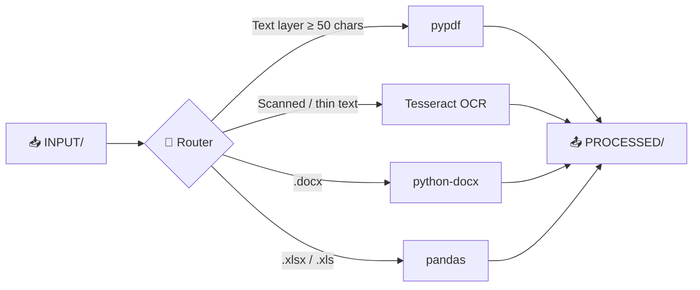
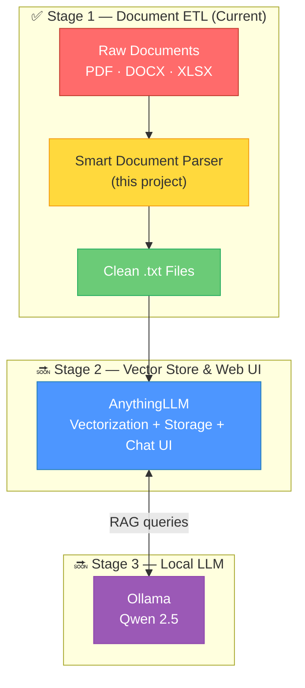

<div align="center">

# 📄 Smart Document Parser

**Modular, containerized ETL pipeline that turns raw corporate documents into LLM-ready text**

[](https://github.com/)
[](https://www.python.org/)
[](https://www.docker.com/)
[](LICENSE)

---

*Drop documents in a folder. Get clean text out. One command. No config.*

[Key Features](#-key-features) · [Quick Start](#-quick-start) · [How It Works](#-how-it-works) · [Roadmap](#-roadmap)

</div>

---

> [!WARNING]
> **Pre-Alpha Software.** This project is under active development. Only **Stage 1** (document extraction & OCR) is currently implemented. APIs, directory layout, and configuration may change without notice.

## 📋 Overview

Smart Document Parser is the first building block of a fully local RAG (Retrieval-Augmented Generation) pipeline. It ingests raw corporate documents — **PDF, DOCX, XLSX, and scanned images** — and produces clean `.txt` files ready for vectorization and consumption by an LLM.

The entire system ships as a single Docker container and is deployed with **one command**, even on machines that don't have Docker installed yet.

## ✨ Key Features

### 🚀 Zero-Touch Deployment
A single `start.sh` script handles **everything**:
- Detects your OS (Debian/Ubuntu, Arch, and derivatives)
- Installs Docker automatically if it's missing
- Detects Live USB / overlay filesystems and self-heals by switching Docker to the `vfs` storage driver
- Builds the image and runs the container — no manual steps required

### 🐳 Optimized Docker Image
- Based on `python:3.10-slim` — minimal footprint
- All apt packages installed with `--no-install-recommends` in a single layer
- Cache-busted layer strategy: OS deps → pip install → app code
- Final image stays lean — no build tools, no dev headers, no bloat

### 🧠 Smart Routing & OCR
- PDFs are inspected for an existing text layer before invoking OCR
- If the text layer contains fewer than `PDF_TEXT_THRESHOLD` characters, the file is automatically **escalated to Tesseract OCR**
- Scanned documents are rasterized at configurable DPI and processed through Tesseract with `rus+eng` language support

### 🔁 Idempotent Processing
- On every run, the pipeline checks `PROCESSED/` for existing output files
- Already-processed documents are **skipped automatically** — safe to re-run at any time
- No database required; idempotency is file-system-based

### 📊 Multi-Format Support

| Format | Engine | Method |
|:-------|:-------|:-------|
| PDF (text layer) | `pypdf` | Direct text extraction |
| PDF (scanned) | `Tesseract OCR` | pdf2image → OCR |
| DOCX | `python-docx` | Paragraph extraction |
| XLSX / XLS | `pandas` | Sheet → Markdown table |

## 📁 Project Structure

```
smart-document-parser/
│
├── start.sh                 # 🚀 Zero-touch deploy script (Docker install + build + run)
├── Dockerfile               # Optimized multi-stage build (python:3.10-slim)
├── requirements.txt         # Python dependencies
├── .env                     # Environment variables (OCR settings, paths)
├── config.py                # Centralized configuration loader
├── main.py                  # Entry point — orchestrates the pipeline
│
├── core/
│   └── router.py            # Smart routing: extension check → text-layer detection → OCR fallback
│
├── extractors/
│   ├── pdf_extractor.py     # Fast text-layer PDF extraction (pypdf)
│   ├── ocr_extractor.py     # OCR pipeline for scanned PDFs (pdf2image + Tesseract)
│   ├── docx_extractor.py    # Word document extraction (python-docx)
│   └── excel_extractor.py   # Excel → Markdown tables (pandas + tabulate)
│
├── utils/
│   └── file_manager.py      # Directory scanning, idempotency logic, file I/O
│
├── INPUT/                   # 📥 Drop your raw documents here
├── PROCESSED/               # 📤 Extracted .txt files (knowledge base)
└── OUTPUT/                  # 📦 Reserved for future pipeline stages
```

## 🚀 Quick Start

### Prerequisites

- A Linux machine (Debian/Ubuntu, Arch, or derivatives)
- `sudo` access

That's it. The script will install Docker for you if needed.

### Run

```bash
# 1. Clone the repository
git clone https://github.com/Falmer-128/smart-db.git
cd smart-document-parser

# 2. Drop your documents into the INPUT/ folder
cp /path/to/your/documents/* INPUT/

# 3. Launch (installs Docker, builds image, runs pipeline)
sudo ./start.sh
```

The script will:

```
══════════════════════════════════════════════
  🚀 Smart Document Parser — Zero-Touch Deploy
══════════════════════════════════════════════

── 1/5  Docker pre-flight check ────────────────
   ✅ Docker already installed: Docker version 24.x.x

── 2/5  Buildx availability ────────────────────
   ✅ Buildx available

── 3/5  Filesystem & storage-driver check ──────
   ✅ Standard filesystem (ext4) — using Docker's default storage driver

── 4/5  Docker daemon ──────────────────────────
   ✅ Docker daemon is enabled and running

── 5/5  Build & run 'smart-parser' ─────────────
   ✅ Image 'smart-parser' built successfully
   ℹ️  Running container...

══════════════════════════════════════════════
  🏁 Deployment complete. All done!
══════════════════════════════════════════════
```

Extracted text files appear in `PROCESSED/`.

### Manual Docker Usage (Advanced)

If you prefer to manage Docker yourself:

```bash
# Build
docker build -t smart-parser .

# Run with volume mounts
docker run --rm \
  -v "$(pwd)/INPUT:/app/INPUT" \
  -v "$(pwd)/PROCESSED:/app/PROCESSED" \
  smart-parser

# Override OCR settings at runtime
docker run --rm \
  -v "$(pwd)/INPUT:/app/INPUT" \
  -v "$(pwd)/PROCESSED:/app/PROCESSED" \
  -e OCR_DPI=200 \
  -e OCR_LANGUAGES=eng \
  smart-parser
```

## ⚙️ Configuration

All settings are controlled via environment variables (defined in `.env`):

| Variable | Default | Description |
|:---------|:--------|:------------|
| `INPUT_DIR` | `INPUT` | Directory to scan for raw documents |
| `PROCESSED_DIR` | `PROCESSED` | Directory for extracted `.txt` files |
| `OUTPUT_DIR` | `OUTPUT` | Reserved for future pipeline stages |
| `OCR_LANGUAGES` | `rus+eng` | Tesseract language packs to use |
| `OCR_DPI` | `300` | Resolution (DPI) for PDF rasterization |
| `PDF_TEXT_THRESHOLD` | `50` | Min characters to consider a PDF's text layer valid |

## 🔍 How It Works



1. **Scan** — `file_manager.py` lists all files in `INPUT/` and filters out already-processed ones (idempotency check against `PROCESSED/`)
2. **Route** — `router.py` inspects the file extension. For PDFs, it first attempts fast text-layer extraction; if the result is below the threshold, it escalates to OCR
3. **Extract** — The matched extractor processes the file and returns clean text
4. **Save** — Extracted text is written to `PROCESSED/<filename>.txt`

## 🗺️ Roadmap

This project is **Stage 1** of a larger vision: a fully local, private RAG system that runs entirely on your hardware — no cloud APIs, no data leaving your machine.



| Stage | Component | Role | Status |
|:------|:----------|:-----|:-------|
| **1** | **Smart Document Parser** | Extract text from corporate documents | ✅ Pre-Alpha |
| **2** | **[AnythingLLM](https://anythingllm.com/)** | Vector database, document embedding, Web UI | 🔜 Planned |
| **3** | **[Ollama](https://ollama.com/) + [Qwen 2.5](https://qwen.readthedocs.io/)** | Local LLM for question answering | 🔜 Planned |

The final architecture will be orchestrated with **Docker Compose** — one `docker compose up` to launch the entire stack.

## 🤝 Contributing

This project is in its earliest stages. If you'd like to contribute:

1. Fork the repository
2. Create a feature branch (`git checkout -b feature/amazing-feature`)
3. Commit your changes (`git commit -m 'Add amazing feature'`)
4. Push to the branch (`git push origin feature/amazing-feature`)
5. Open a Pull Request

## 📄 License

This project is licensed under the MIT License — see the [LICENSE](LICENSE) file for details.

---

<div align="center">

**Built with ❤️ for the local-first AI community**

*If this project helped you, consider giving it a ⭐*

</div>
