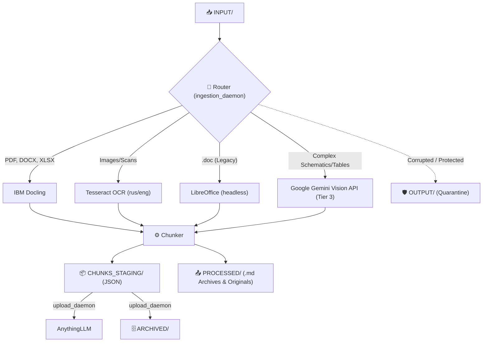
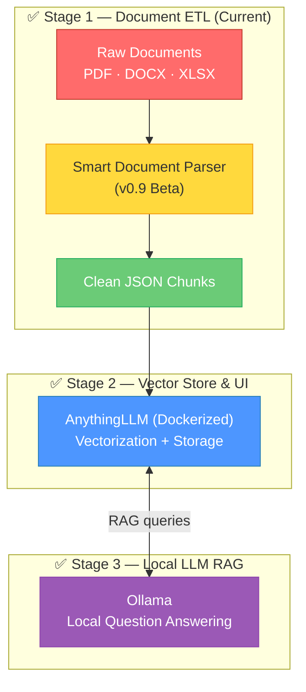

<div align="center">

# 📄 Smart Document Parser

**Локальный модульный ETL-конвейер, превращающий сырые корпоративные документы в идеальные JSON-чанки для LLM.**

[](https://github.com/)
[](https://www.python.org/)
[](#)
[](LICENSE)

---

*Drop documents in a folder. Get clean JSON chunks out. One command. Fully local.*

[🇷🇺 Читать на русском](README_RU.md) · [Key Features](#-key-features) · [Quick Start](#-quick-start) · [How It Works](#-how-it-works) · [Roadmap](#-roadmap)

</div>

---

> [!WARNING]
> **v0.9 Beta Software.** Active development. Phase 1 (smart parsing, routing, and chunking) is implemented. APIs, directory layout, and configuration may change without notice.

## 📋 Overview

Smart Document Parser is the first building block of a fully local RAG (Retrieval-Augmented Generation) pipeline. It ingests raw corporate documents — **PDF, DOCX, DOC, XLSX, CSV, and scanned images** — and produces clean `.json` chunk files ready for vectorization and consumption by an LLM.

The entire system runs as a lightweight Python background daemon and is deployed with **one command** locally, with no Docker required (Except for AnythingLLM).

## ✨ Key Features

### 🛠️ Tech Stack
- **Extraction**: IBM Docling, Tesseract OCR (rus/eng), LibreOffice headless (for `.doc`).
- **Cloud Fallback (Tier 3)**: Google Gemini Vision API (for complex schematics and tables).
- **RAG & UI**: AnythingLLM (Dockerized).
- **Local LLM**: Ollama.

### 🚀 Zero-Touch Deployment
A single `setup.sh` script handles **everything**:
- Automatically creates an isolated Python virtual environment (`.venv`).
- Installs all necessary dependencies.
- Launches the daemons in the background.

### 🛡️ Smart Routing & Fault Tolerance (Body Armor)
- Files are intelligently routed by their extension to specialized parsers.
- **Body Armor:** The daemon is wrapped in robust `try/except` blocks. Password-protected Excel files, corrupted Word documents, or malformed PDFs will not crash the daemon; they are safely quarantined in the `OUTPUT/` folder.
- **Resilient Tier 3 Gemini Fallback:** Features robust network retry logic (handles 504 errors, network drops by waiting 60s up to 5 times) so documents never stall.

### 🔁 Deduplication
- The daemon calculates an MD5 hash of the first 300 words of every document and saves them to `content_hashes.json`.
- Identical documents are deleted instantly, preventing redundant processing and saving valuable disk space and API calls.

### ⚙️ Core Daemons & Orchestration
- **`orchestrator.py`**: Monitors `INPUT/`. Kills LLM to free VRAM for OCR. Crucially, it now waits for exactly **10 seconds of silence** (empty INPUT) before stopping OCR and booting the LLM/Upload daemon.
- **`ingestion_daemon.py`**: Monitors `INPUT/` and processes the documents. Features resilient "Tier 3" Gemini fallback.
- **`upload_daemon.py`**: Monitors `CHUNKS_STAGING/`. Uploads vectors to AnythingLLM and moves chunks to `ARCHIVED/`.

### ⚙️ Configuration (Soft Decoupling)
- Root `.env` is the infrastructure Source of Truth.
- AnythingLLM uses an isolated `.env.anythingllm` via Docker to prevent config overwrites.

## 📁 Project Structure & Pipeline

```text
smart-db/
│
├── setup.sh                 # 🚀 Zero-touch deploy script
├── .env                     # Root configuration & API Keys (Source of Truth)
├── .env.anythingllm         # Isolated config for AnythingLLM (via Docker)
├── orchestrator.py          # Monitors INPUT/ and manages VRAM (10s silence logic)
├── ingestion_daemon.py      # Monitors INPUT/ and extracts documents
├── upload_daemon.py         # Monitors CHUNKS_STAGING/ and uploads to AnythingLLM
│
├── INPUT/                   # 📥 Raw documents drop zone.
├── CHUNKS_STAGING/          # 📦 Processed JSON chunks.
├── PROCESSED/               # 📤 Successfully extracted original documents and .md backups.
├── OUTPUT/                  # 🛡️ Quarantine for corrupted/password-protected files.
└── ARCHIVED/                # 🗄️ JSON chunks successfully uploaded to AnythingLLM.
```

## 🚀 Quick Start

### Prerequisites

- A Linux machine (tested on Linux Mint/Ubuntu).
- Python 3.10+
- Docker (for AnythingLLM)

### Run the Pipeline

```bash
# 1. Clone the repository
git clone https://github.com/Falmer-128/smart-db.git
cd smart-db

# 2. Launch the deployment script (creates venv, installs deps, starts daemon)
./setup.sh

# 3. Drop your documents into the INPUT/ folder
cp /path/to/your/documents/* INPUT/
```

Extracted chunks will start appearing in `CHUNKS_STAGING/`, and then moved to `ARCHIVED/` by the upload daemon.

### Stopping the Daemon

When you want to stop the background daemons, simply run:

```bash
pkill -f "python3.*_daemon.py"
pkill -f "python3.*orchestrator.py"
```

## 🔍 How It Works



## 🗺️ Roadmap

This project is part of a larger vision: a fully local, private RAG system that runs entirely on your hardware.



| Stage | Component | Role | Status |
|:------|:----------|:-----|:-------|
| **1** | **Smart Document Parser** | Extract, clean, and chunk text from corporate documents | ✅ v0.9 Beta |
| **2** | **AnythingLLM** | UI and Vector database | ✅ Implemented |
| **3** | **Ollama** | Local LLM for private, fast question answering | ✅ Implemented |

## 🤝 Contributing

This project is in its earliest stages. If you'd like to contribute:

1. Fork the repository
2. Create a feature branch (`git checkout -b feature/amazing-feature`)
3. Commit your changes (`git commit -m 'Add amazing feature'`)
4. Push to the branch (`git push origin feature/amazing-feature`)
5. Open a Pull Request

## 📄 License

This project is licensed under the MIT License — see the [LICENSE](LICENSE) file for details.

---

<div align="center">

**Built with ❤️ for the local-first AI community**

*If this project helped you, consider giving it a ⭐*

</div>
