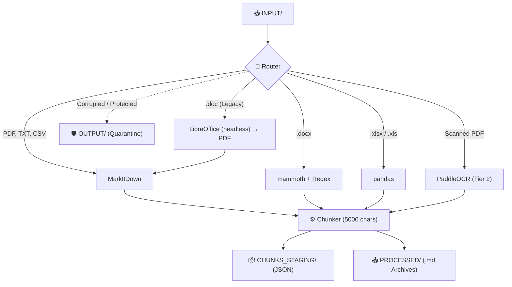
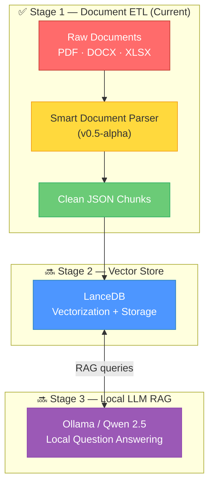

<div align="center">

# 📄 Smart Document Parser

**Локальный модульный ETL-конвейер, превращающий сырые корпоративные документы в идеальные JSON-чанки для LLM.**

[](https://github.com/)
[](https://www.python.org/)
[](#)
[](LICENSE)

---

*Drop documents in a folder. Get clean JSON chunks out. One command. Fully local.*

[🇷🇺 Читать на русском](README_RU.md) [Key Features](#-key-features) · [Quick Start](#-quick-start) · [How It Works](#-how-it-works) · [Roadmap](#-roadmap)

</div>

---

> [!WARNING]
> **v0.5-alpha Software.** Active development. Phase 1 (smart parsing, routing, and chunking) is implemented. APIs, directory layout, and configuration may change without notice.

## 📋 Overview

Smart Document Parser is the first building block of a fully local RAG (Retrieval-Augmented Generation) pipeline. It ingests raw corporate documents — **PDF, DOCX, DOC, XLSX, CSV, and scanned images** — and produces clean `.json` chunk files ready for vectorization and consumption by an LLM.

The entire system runs as a lightweight Python background daemon and is deployed with **one command** locally, with no Docker required.

## ✨ Key Features

### 🚀 Zero-Touch Deployment
A single `setup.sh` script handles **everything**:
- Automatically creates an isolated Python virtual environment (`.venv`).
- Installs all necessary dependencies including `pandas`, `mammoth`, `paddleocr`, and `markitdown`.
- Launches the `ingestion_daemon.py` watchdog in the background.

### 🛡️ Smart Routing & Fault Tolerance (Body Armor)
- Files are intelligently routed by their extension to specialized parsers.
- **Body Armor:** The daemon is wrapped in robust `try/except` blocks. Password-protected Excel files, corrupted Word documents, or malformed PDFs will not crash the daemon; they are safely quarantined in the `OUTPUT/` folder.
- **Kill Switch for Gemini:** For Tier 3 complex images, the pipeline checks for a Gemini API key. If the key is missing in your `.env`, it securely skips Tier 3 without crashing the entire pipeline.

### 🔁 Deduplication
- The daemon calculates an MD5 hash of the first 300 words of every document and saves them to `content_hashes.json`.
- Identical documents are deleted instantly, preventing redundant processing and saving valuable disk space and API calls.

### 📊 Multi-Format Support

| Format | Engine | Method & Strategy |
|:-------|:-------|:-------|
| PDF, TXT, CSV | `MarkItDown` | Fast, native text extraction using Microsoft's MarkItDown engine. |
| XLSX / XLS | `pandas` | Uses `dtype=str` to ignore math/float errors on empty cells. Sliced into massive 5000-character chunks to keep tables perfectly intact. |
| DOCX | `mammoth` + Regex | Converts Word to Markdown while utilizing Regex to strip massive Base64 inline images (e.g., logos) to keep the LLM context clean. |
| DOC (Legacy) | LibreOffice (headless) | Invisible background conversion to `.pdf`, which is then routed to MarkItDown for clean text extraction. |
| Scanned PDF | `PaddleOCR` (Tier 2) | Employs PaddleOCR with PP-Structure for visual table recognition (WIP). |

## 📁 Project Structure

```text
smart-db/
│
├── setup.sh                 # 🚀 Zero-touch deploy script (venv + dependencies + daemon)
├── .env                     # Environment variables (API Keys, config)
├── ingestion_daemon.py      # Watchdog daemon that monitors the INPUT/ directory
│
├── INPUT/                   # 📥 Drop raw documents here.
├── PROCESSED/               # 📤 Original files and full .md archives.
├── CHUNKS_STAGING/          # 📦 Final .json chunks for Vector DB.
└── OUTPUT/                  # 🛡️ Quarantine for corrupted/password-protected files.
```

## 🚀 Quick Start

### Prerequisites

- A Linux machine (tested on Linux Mint/Ubuntu).
- Python 3.10+

### Run the Pipeline

```bash
# 1. Clone the repository
git clone https://github.com/Falmer-128/smart-db.git
cd smart-db

# 2. Launch the deployment script (creates venv, installs deps, starts daemon)
./setup.sh

# 3. Drop your documents into the INPUT/ folder
cp /path/to/your/documents/* INPUT/
```

Extracted chunks will start appearing in `CHUNKS_STAGING/`.

### Stopping the Daemon

When you want to stop the background ingestion daemon, simply run:

```bash
pkill -f "python3.*ingestion_daemon.py"
```

## 🔍 How It Works



## 🗺️ Roadmap

This project is part of a larger vision: a fully local, private RAG system that runs entirely on your hardware.



| Stage | Component | Role | Status |
|:------|:----------|:-----|:-------|
| **1** | **Smart Document Parser** | Extract, clean, and chunk text from corporate documents | ✅ v0.5-alpha |
| **2** | **LanceDB** | Vector database for ultra-fast document embedding retrieval | 🔜 Planned |
| **3** | **Ollama + Qwen 2.5** | Local LLM for private, fast question answering | 🔜 Planned |

## 🤝 Contributing

This project is in its earliest stages. If you'd like to contribute:

1. Fork the repository
2. Create a feature branch (`git checkout -b feature/amazing-feature`)
3. Commit your changes (`git commit -m 'Add amazing feature'`)
4. Push to the branch (`git push origin feature/amazing-feature`)
5. Open a Pull Request

## 📄 License

This project is licensed under the MIT License — see the [LICENSE](LICENSE) file for details.

---

<div align="center">

**Built with ❤️ for the local-first AI community**

*If this project helped you, consider giving it a ⭐*

</div>
