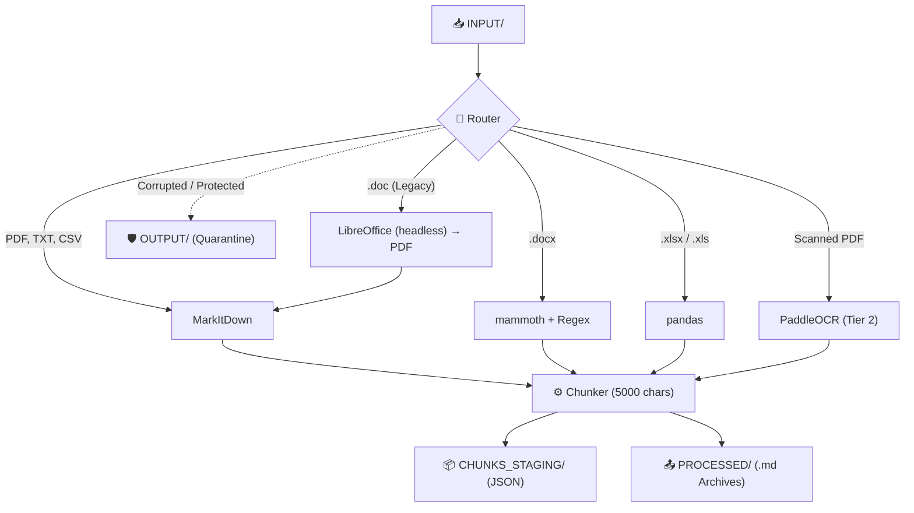
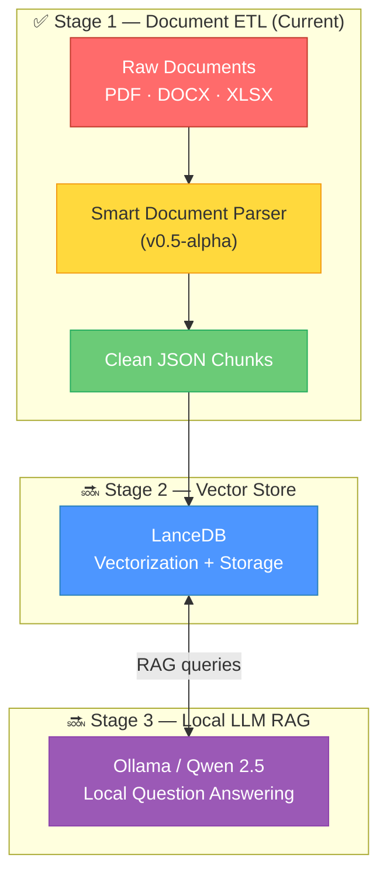

<div align="center">

# 📄 Smart Document Parser

**Локальный модульный ETL-конвейер, превращающий сырые корпоративные документы в идеальные JSON-чанки для LLM.**

[](https://github.com/)
[](https://www.python.org/)
[](#)
[](LICENSE)

---

*Положите документы в папку. Получите чистые JSON-чанки. Одна команда. Полностью локально.*

[🇬🇧 Read in English](README.md) · [Ключевые фичи](#-ключевые-фичи) · [Быстрый старт](#-быстрый-старт) · [Как это работает](#-как-это-работает) · [Roadmap](#-roadmap)

</div>

---

> [!WARNING]
> **ПО стадии v0.5-alpha.** Активная разработка. Реализована Фаза 1 (умный парсинг, маршрутизация и чанкинг). API, структура директорий и конфигурация могут быть изменены без предупреждения.

## 📋 О проекте

Smart Document Parser — это первый структурный блок полностью локального RAG-конвейера (Retrieval-Augmented Generation). Он поглощает сырые корпоративные документы — **PDF, DOCX, DOC, XLSX, CSV и отсканированные изображения** — и создает чистые `.json` файлы с чанками, готовые к векторизации и использованию LLM.

Вся система работает как легковесный фоновый Python-демон (Watchdog) и разворачивается **одной командой** локально, без необходимости использования Docker.

## ✨ Ключевые фичи

### 🚀 Развертывание в один клик (Zero-Touch Deployment)
Один скрипт `setup.sh` делает **всё**:
- Автоматически создает изолированное виртуальное окружение Python (`.venv`).
- Устанавливает все необходимые зависимости, включая `pandas`, `mammoth`, `paddleocr` и `markitdown`.
- Запускает фоновый демон-Watchdog `ingestion_daemon.py`.

### 🛡️ Умная маршрутизация и отказоустойчивость (Body Armor)
- Файлы интеллектуально маршрутизируются к специализированным парсерам на основе их расширений.
- **Body Armor:** Демон защищен надежными блоками `try/except`. Excel-файлы под паролем, поврежденные Word-документы или некорректные PDF не обрушат демона; они безопасно отправляются в карантин в папку `OUTPUT/`.
- **Kill Switch для Gemini:** Для обработки сложных изображений (Tier 3) конвейер проверяет наличие API-ключа Gemini. Если ключ отсутствует в вашем `.env`, он безопасно пропускает Tier 3 без падения всего конвейера.

### 🔁 Дедупликация
- Демон вычисляет MD5-хэш первых 300 слов каждого документа и сохраняет их в `content_hashes.json`.
- Идентичные документы удаляются мгновенно, что предотвращает их повторную обработку и экономит дисковое пространство и API-запросы.

### 📊 Поддержка множества форматов

| Формат | Движок | Метод и стратегия |
|:-------|:-------|:-------|
| PDF, TXT, CSV | `MarkItDown` | Быстрое нативное извлечение текста с использованием движка Microsoft MarkItDown. |
| XLSX / XLS | `pandas` | Использует `dtype=str`, чтобы игнорировать математические/float ошибки в пустых ячейках. Файл разбивается на массивные чанки по 5000 символов, чтобы сохранить таблицы в идеальном виде. |
| DOCX | `mammoth` + Regex | Конвертирует Word в Markdown, используя Regex для удаления огромных инлайн-изображений в формате Base64 (например, логотипов), чтобы сохранить контекст LLM чистым. |
| DOC (Legacy) | LibreOffice (headless) | Невидимая фоновая конвертация в `.pdf`, который затем направляется в MarkItDown для чистого извлечения текста. |
| Scanned PDF | `PaddleOCR` (Tier 2) | Применяет PaddleOCR с PP-Structure для визуального распознавания таблиц (WIP). |

## 📁 Структура директорий

```text
smart-db/
│
├── setup.sh                 # 🚀 Скрипт развертывания (venv + зависимости + демон)
├── .env                     # Переменные окружения (API-ключи, конфиг)
├── ingestion_daemon.py      # Watchdog демон, мониторящий директорию INPUT/
│
├── INPUT/                   # 📥 Положите сырые документы сюда.
├── PROCESSED/               # 📤 Оригинальные файлы и полные .md архивы.
├── CHUNKS_STAGING/          # 📦 Финальные .json чанки для Vector DB.
└── OUTPUT/                  # 🛡️ Карантин для поврежденных файлов и файлов под паролем.
```

## 🚀 Быстрый старт

### Требования

- Linux-машина (протестировано на Linux Mint/Ubuntu).
- Python 3.10+

### Запуск конвейера

```bash
# 1. Клонируйте репозиторий
git clone https://github.com/Falmer-128/smart-db.git
cd smart-db

# 2. Запустите скрипт развертывания (создает venv, ставит зависимости, запускает демона)
./setup.sh

# 3. Переместите ваши документы в папку INPUT/
cp /path/to/your/documents/* INPUT/
```

Извлеченные чанки начнут появляться в `CHUNKS_STAGING/`.

### Остановка демона

Если вы хотите остановить фоновый демон, просто выполните:

```bash
pkill -f "python3.*ingestion_daemon.py"
```

## 🔍 Как это работает



## 🗺️ Roadmap

Этот проект является частью более масштабного видения: полностью локальной, приватной системы RAG, которая работает исключительно на вашем оборудовании.



| Стадия | Компонент | Роль | Статус |
|:------|:----------|:-----|:-------|
| **1** | **Smart Document Parser** | Извлечение, очистка и чанкинг текста из корпоративных документов | ✅ v0.5-alpha |
| **2** | **LanceDB** | Векторная база данных для сверхбыстрого поиска эмбеддингов документов | 🔜 Запланировано |
| **3** | **Ollama + Qwen 2.5** | Локальная LLM для приватных, быстрых ответов на вопросы | 🔜 Запланировано |

## 🤝 Вклад в проект (Contributing)

Проект находится на самых ранних этапах. Если вы хотите внести свой вклад:

1. Сделайте форк (Fork) репозитория
2. Создайте ветку для фичи (`git checkout -b feature/amazing-feature`)
3. Закоммитьте изменения (`git commit -m 'Add amazing feature'`)
4. Запушьте в ветку (`git push origin feature/amazing-feature`)
5. Откройте Pull Request

## 📄 Лицензия

Этот проект лицензируется на условиях MIT License — подробнее смотрите в файле [LICENSE](LICENSE).

---

<div align="center">

**Сделано с ❤️ для локального AI-комьюнити**

*Если этот проект вам помог, пожалуйста, поставьте ⭐*

</div>
