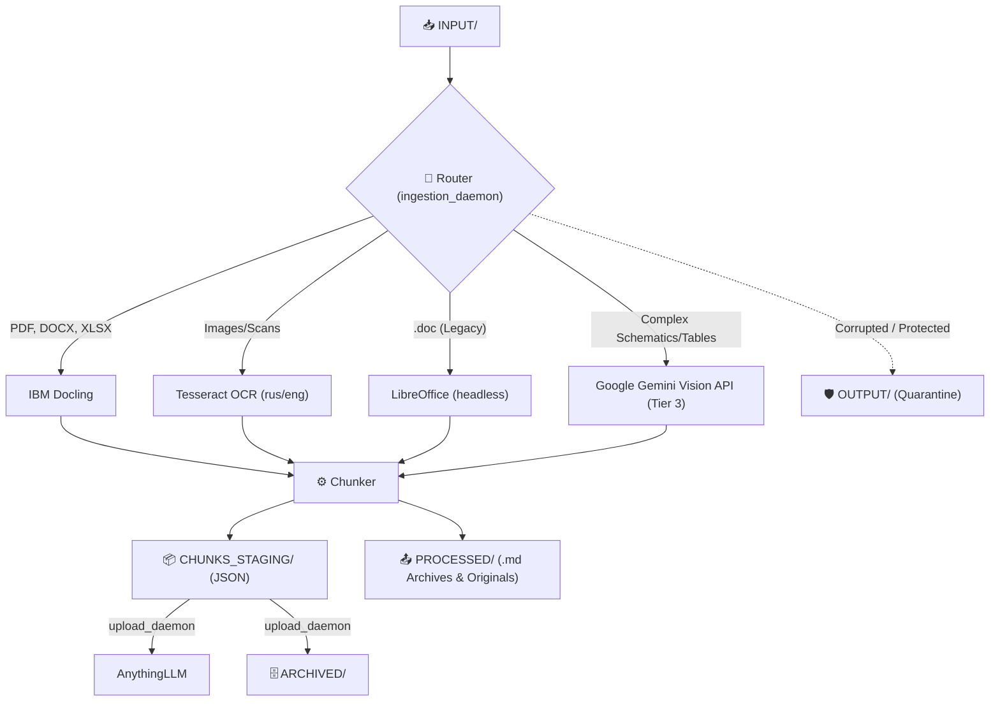
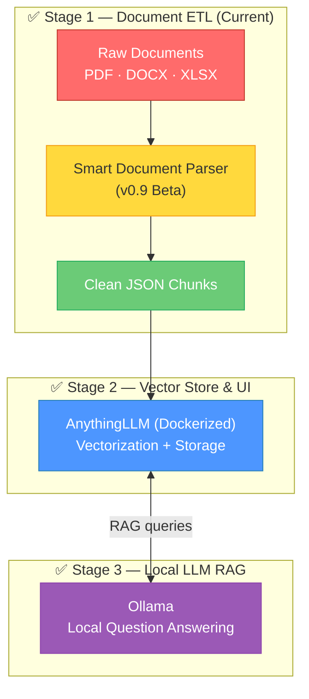

<div align="center">

# 📄 Smart Document Parser

**Локальный модульный ETL-конвейер, превращающий сырые корпоративные документы в идеальные JSON-чанки для LLM.**

[](https://github.com/)
[](https://www.python.org/)
[](#)
[](LICENSE)

---

*Положите документы в папку. Получите чистые JSON-чанки. Одна команда. Полностью локально.*

[🇬🇧 Read in English](README.md) · [Ключевые фичи](#-ключевые-фичи) · [Быстрый старт](#-быстрый-старт) · [Как это работает](#-как-это-работает) · [Roadmap](#-roadmap)

</div>

---

> [!WARNING]
> **ПО стадии v0.9 Beta.** Активная разработка. Разработаны умный парсинг, маршрутизация, чанкинг и загрузка в векторную БД. API, структура директорий и конфигурация могут быть изменены без предупреждения.

## 📋 О проекте

Smart Document Parser — это первый структурный блок полностью локального RAG-конвейера (Retrieval-Augmented Generation). Он поглощает сырые корпоративные документы — **PDF, DOCX, DOC, XLSX, CSV и отсканированные изображения** — и создает чистые `.json` файлы с чанками, готовые к векторизации и использованию LLM.

Вся система работает как набор легковесных фоновых Python-демонов и разворачивается **одной командой** локально (Docker нужен только для AnythingLLM).

## ✨ Ключевые фичи

### 🛠️ Технологический стек
- **Извлечение (Extraction)**: IBM Docling, Tesseract OCR (rus/eng), LibreOffice headless (для `.doc`).
- **Облачный запасной вариант (Cloud Fallback - Tier 3)**: Google Gemini Vision API (для сложных схем и таблиц).
- **RAG и UI**: AnythingLLM (в Docker).
- **Локальная LLM**: Ollama.

### 🚀 Развертывание в один клик (Zero-Touch Deployment)
Один скрипт `setup.sh` делает **всё**:
- Автоматически создает изолированное виртуальное окружение Python (`.venv`).
- Устанавливает все необходимые зависимости.
- Запускает фоновые демоны.

### 🛡️ Умная маршрутизация и отказоустойчивость (Body Armor)
- Файлы интеллектуально маршрутизируются к специализированным парсерам на основе их расширений.
- **Body Armor:** Демоны защищены надежными блоками `try/except`. Excel-файлы под паролем, поврежденные Word-документы или некорректные PDF не обрушат систему; они безопасно отправляются в карантин в папку `OUTPUT/`.
- **Отказоустойчивый Tier 3 Gemini Fallback:** Надежная логика повторных сетевых запросов (обрабатывает ошибки 504, обрывы сети, ожидая по 60 секунд до 5 раз), чтобы документы никогда не зависали.

### 🔁 Дедупликация
- Демон вычисляет MD5-хэш первых 300 слов каждого документа и сохраняет их в `content_hashes.json`.
- Идентичные документы удаляются мгновенно, что предотвращает их повторную обработку и экономит дисковое пространство и API-запросы.

### ⚙️ Базовые демоны и оркестрация
- **`orchestrator.py`**: Мониторит `INPUT/`. Убивает процесс LLM, чтобы освободить VRAM для OCR. Критически важно: теперь он ждет ровно **10 секунд тишины** (пустой INPUT) перед остановкой OCR и запуском демона загрузки и LLM.
- **`ingestion_daemon.py`**: Мониторит `INPUT/` и извлекает данные. Включает отказоустойчивый фолбэк к Gemini ("Tier 3").
- **`upload_daemon.py`**: Мониторит `CHUNKS_STAGING/`. Загружает векторы в AnythingLLM и перемещает чанки в `ARCHIVED/`.

### ⚙️ Конфигурация (Soft Decoupling)
- Корневой `.env` является единым источником истины (Source of Truth) для инфраструктуры.
- AnythingLLM использует изолированный `.env.anythingllm` через Docker для предотвращения перезаписи конфигурации.

## 📁 Структура директорий и конвейер

```text
smart-db/
│
├── setup.sh                 # 🚀 Скрипт развертывания
├── .env                     # Основной конфиг и ключи API (Source of Truth)
├── .env.anythingllm         # Изолированный конфиг для AnythingLLM (Docker)
├── orchestrator.py          # Управляет VRAM (логика 10 секунд тишины)
├── ingestion_daemon.py      # Мониторит INPUT/ и парсит документы
├── upload_daemon.py         # Мониторит CHUNKS_STAGING/ и загружает в AnythingLLM
│
├── INPUT/                   # 📥 Зона сброса сырых документов (Drop zone).
├── CHUNKS_STAGING/          # 📦 Обработанные JSON-чанки.
├── PROCESSED/               # 📤 Успешно обработанные оригиналы и .md бэкапы.
├── OUTPUT/                  # 🛡️ Карантин для поврежденных файлов и файлов под паролем.
└── ARCHIVED/                # 🗄️ JSON-чанки, успешно загруженные в AnythingLLM.
```

## 🚀 Быстрый старт

### Требования

- Linux-машина (протестировано на Linux Mint/Ubuntu).
- Python 3.10+
- Docker (для AnythingLLM)

### Запуск конвейера

```bash
# 1. Клонируйте репозиторий
git clone https://github.com/Falmer-128/smart-db.git
cd smart-db

# 2. Запустите скрипт развертывания (создает venv, ставит зависимости, запускает демона)
./setup.sh

# 3. Переместите ваши документы в папку INPUT/
cp /path/to/your/documents/* INPUT/
```

Извлеченные чанки начнут появляться в `CHUNKS_STAGING/`, а затем загрузятся в `ARCHIVED/`.

### Остановка демонов

Если вы хотите остановить фоновые процессы, просто выполните:

```bash
pkill -f "python3.*_daemon.py"
pkill -f "python3.*orchestrator.py"
```

## 🔍 Как это работает



## 🗺️ Roadmap

Этот проект является частью более масштабного видения: полностью локальной, приватной системы RAG, которая работает исключительно на вашем оборудовании.



| Стадия | Компонент | Роль | Статус |
|:------|:----------|:-----|:-------|
| **1** | **Smart Document Parser** | Извлечение, очистка и чанкинг текста из корпоративных документов | ✅ v0.9 Beta |
| **2** | **AnythingLLM** | Векторная база данных и UI | ✅ Реализовано |
| **3** | **Ollama** | Локальная LLM для приватных, быстрых ответов на вопросы | ✅ Реализовано |

## 🤝 Вклад в проект (Contributing)

Проект находится на самых ранних этапах. Если вы хотите внести свой вклад:

1. Сделайте форк (Fork) репозитория
2. Создайте ветку для фичи (`git checkout -b feature/amazing-feature`)
3. Закоммитьте изменения (`git commit -m 'Add amazing feature'`)
4. Запушьте в ветку (`git push origin feature/amazing-feature`)
5. Откройте Pull Request

## 📄 Лицензия

Этот проект лицензируется на условиях MIT License — подробнее смотрите в файле [LICENSE](LICENSE).

---

<div align="center">

**Сделано с ❤️ для локального AI-комьюнити**

*Если этот проект вам помог, пожалуйста, поставьте ⭐*

</div>
